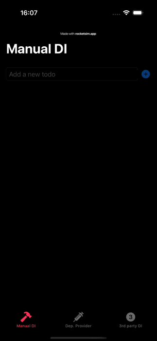
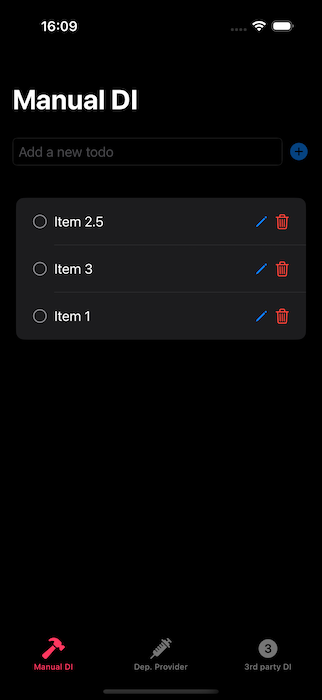
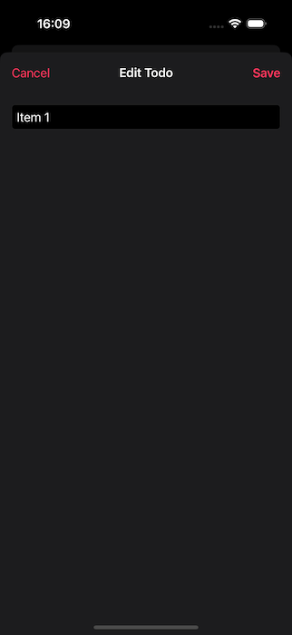
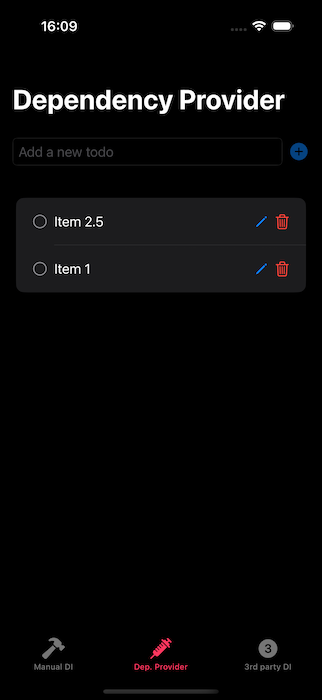

# Dependency Injection Showcase

## App overview:

|  |  |  |  |
| ------------------------------ | ------------------------------- | ------------------------------- | ------------------------------- |

The app is a small, modular to-do list that demonstrates three different approaches to dependency injection:

- **Manual Dependency Injection** - passing dependencies directly into the modules.
- **Using (manually implemented) `Dependency Provider`** - provides a reference to the `DependencyProvider` that fetches required dependencies within a module.
- **Using third party Dependency Injection library [Swinject](https://github.com/Swinject/Swinject)** - implements the same concepts using a renowned third-party DI framework
- The app supports **iOS 17.6** on an **iPhone** device.

## App Setup:

The application is fairly stratigforward to set up.
Just follow these steps:

1. Install Xcode 16+ (16.2 recommended).
2. Open `DIShowcase.xcworkspace`.
3. Select `DIShowcase` schema to run the app.
4. Select `DIShowcaseTests` to run tests.

## The Challenges:

The app aims to battle-test different Dependency Injection techniques in a fully modular iOS app. Here are the key challenges this approach presents:

- **Each of the features comes from a different module.** 
  We must ensure proper scope for the public-facing APIs while encapsulating implementation details and avoiding circular dependencies.
- **Each feature requires different way of passing dependencies.** 
  The factory creating each feature needs appropriate dependencies and must know how to extract them from their container or provider.
- **Each feature should reuse the main app resources (e.g. storage) without conflicts.** 
  When adding a note in the manual DI to-do list tab, it should appear in the other implementations: the `DependencyProvider` and third-party DI library lists.
- **Ensure testability of all the modules.** 
  While testing reusable components or `Storage` is straightforward, can we achieve reliable coverage for feature modules?

## The app structure:

The app blueprint resembles the one I described in my [article about building scalable, modular iOS apps](https://swiftandmemes.com/how-to-build-a-robust-and-scalable-modular-ios-app/).

1. **The Foundation - `Common` modules:**
   They contain all the shared data models, protocols describing critical app services (e.g. `LocalStorage`), reusable UI components, helpful extensions, etc.
2. **Ground floor - utility modules, like `Storage`:**
   These are more specialized than the `Commons` but don't provide any business value by themselves. They typically don't contain UI either. These modules focus on providing specialized, targeted functionality to the componentes *higher up the food chain*.
3. **First Floor - feature modules:**
   These are focused on delivering particular business value. In this example we have: `ManualDIToDoList`, `DependencyProviderToDoList` and `ThirdPartyDIToDoList`. Each of these modules produces a simple to-do list feature, leveraging different dependency injection techniques. As these features mainly use shared UI components, there isn't much code inside. As it should be! We don't want to duplicate our UI components across different feature modules, do we?
4. **Second floor - a wrapper module: `DIShowcasePackage`:** 
   It is the only user-facing `SPM Product` exposed by the modules package. Its sole job is to aggregate all the modules that the user-facing app requires and package them under a single wrapper. This way, in the app, we can access all the required features by simply using `import DIShowcasePackage`.
5. **The penthouse - the app:** 
   It imports `DIShowcasePackage` as a local dependency and uses it to generate its features.
